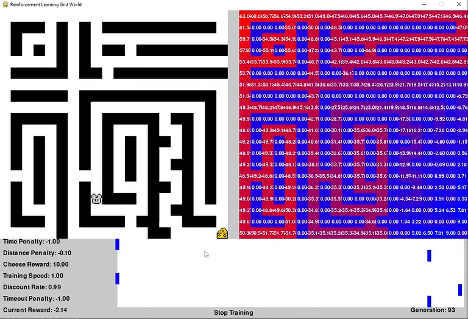

# Reinforcement Learning Mouse Game



This project implements a simple reinforcement learning environment using Pygame, where an agent learns to navigate a grid world to reach a piece of cheese while avoiding obstacles.

## Features

- Grid-based world with customizable size and obstacles.
- Q-Learning agent that learns optimal paths to the cheese.
- Adjustable parameters via sliders for time penalty, distance penalty, cheese reward, training speed, discount rate, and timeout penalty.
- Visualization of Q-values to understand the agent's learning progress.
- Background music and visual elements (mouse and cheese images).

## Installation

1. Clone the repository:

   ```
   git clone https://github.com/MrHumble-Bee/RL-MouseGame.git
   cd RL-MouseGame
   ```

2. Install dependencies:

   ```
   pip install pygame numpy
   ```

3. Run the game:

   ```
   python main.py
   ```

## How to Play

- Left-click on the grid to add walls.
- Right-click on the grid to remove walls.
- Adjust sliders to change game parameters and start/stop training.
- Watch the agent learn and navigate towards the cheese!

## Controls

- Left-click: Add wall (during grid editing).
- Right-click: Remove wall (during grid editing).
- Left-click on sliders to adjust parameters.

## Dependencies

- Python 3.x
- Pygame
- NumPy


